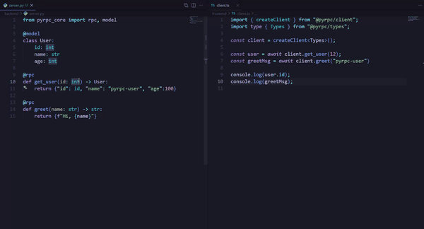

<div align="center">
  <picture>
    <source media="(prefers-color-scheme: dark)" srcset="docs/public/branding/png/pyrpc-wordmark-bg-dark.png" />
    <source media="(prefers-color-scheme: light)" srcset="docs/public/branding/png/pyrpc-wordmark-bg-light.png" />
    
  </picture>
</div>

<h1 align="center">
  Type-safe RPC for Python &amp; TypeScript
</h1>

<h4 align="center">
  One <code>@rpc</code> decorator defines the endpoint, generates TypeScript types, and validates every request at runtime.
</h4>

<p align="center">
  <a href="https://pyrpc.com/docs"><b>Docs</b></a>
  ·
  <a href="https://pyrpc.com/changelog"><b>Changelog</b></a>
  ·
  <a href="https://x.com/pyrpc_dev"><b>Community</b></a>
</p>

<p align="center">
  <a href="https://pypi.org/project/pyrpc-core/">
    
  </a>
  <a href="https://github.com/pyrpc/pyrpc/stargazers">
    
  </a>
</p>

<div align="center">
  
  <p align="center"><em>Change a Python type. TypeScript knows instantly.</em></p>
</div>
<br />

## Install

> pyRPC is in active development. APIs may change as we approach a stable release. Read the [changelog](https://pyrpc.com/changelog) and [roadmap](./ROADMAP.md) for direction.

```bash
uv add pyrpc-core
```

Framework adapters are available as extras, the adapter is included in the same install:

```bash
uv add pyrpc-core[fastapi]   # FastAPI
uv add pyrpc-core[flask]     # Flask
uv add pyrpc-core[django]    # Django
uv add pyrpc-core[mcp]       # MCP (AI agent integration)
```

## Quick Start

### 1. Define your procedures

```python
from pyrpc_core import rpc, model

@model
class User:
    name: str
    age: int

@rpc.query
def add(a: int, b: int) -> int:
    return a + b

@rpc.query
def greet(user: User) -> str:
    return f"Hello, {user.name}!"
```

### 2. Start the dev server

```bash
pyrpc dev
```

First run: a short wizard asks for your backend framework and entry point, then your client project root and frontend framework (the wizard preselects what it detects), and writes `pyrpc.json`. Every run after: reads `pyrpc.json`, no questions asked. Launches your framework's native dev server (uvicorn for FastAPI/ASGI, `flask run` for Flask, `manage.py runserver` for Django), watches `.py` files, and regenerates TypeScript types automatically.

Non-interactive (CI): `pyrpc dev --yes --framework fastapi --module main --client ../frontend`.

### 3. Call from TypeScript

```ts
import type { Types } from "@pyrpc/types"
import { createClient, httpLink } from "@pyrpc/client"

const api = createClient<Types>({
  links: [httpLink({ url: "http://localhost:8000" })],
})
const result = await api.add(10, 5)
console.log(result)  // 15
```

Framework adapters (TanStack Query): `@pyrpc/react`, `@pyrpc/next`, `@pyrpc/vue`, `@pyrpc/svelte`.

```bash
npm install @pyrpc/next @tanstack/react-query    # Next.js
npm install @pyrpc/react @tanstack/react-query   # React (Vite)
npm install @pyrpc/vue @tanstack/react-query     # Vue
npm install @pyrpc/svelte @tanstack/react-query  # Svelte
```

See [docs](https://pyrpc.com/docs/client/adapters/react) and `examples/fastapi-nextjs`.

### 4. Or from Python

```python
from pyrpc_core import RPCClient

with RPCClient("http://localhost:8000") as client:
    result = client.add(10, 5)
    print(f"Result: {result}")
```

---

## How types flow

```
Python @rpc decorator
  → pyrpc dev watches .py files
  → regenerates <client>/__pyrpc.ts
  → tsconfig paths: "@pyrpc/types" → "./__pyrpc.ts"
  → import type { Types } from "@pyrpc/types"  ✓
```

`pyrpc dev` configures the `@pyrpc/types` resolution automatically on every dev and watch run: it injects the tsconfig paths entry via `jsonc-edit` (preserving comments and trailing commas) and adds a bundler alias for Vite, SvelteKit, and Next.js Turbopack, which don't honor tsconfig `paths` for imports inside `node_modules`. `pyrpc.json` (written on first `pyrpc dev` run) stores your backend framework and entry point plus one or more client project roots. No further config needed.

---

## Documentation

- [Docs site](https://pyrpc.com/docs) - guides, API reference, mental model
- [examples/](./examples/) - complete server and client implementations
- [PYRPC.md](./PYRPC.md) - architecture, invariants, and contributor policy
- [Changelog](https://pyrpc.com/changelog) - per-release changes

## Contributing

pyRPC is a free and open source project licensed under the [MIT License](./LICENSE). You are free to do whatever you want with it.

You can help continue its development by:

- [Contributing to the source code](./CONTRIBUTING.md)
- [Suggesting new features and reporting issues](https://github.com/pyrpc/pyrpc/issues)

## Security

If you discover a security vulnerability within pyRPC, please report it via [GitHub Security Advisories](https://github.com/pyrpc/pyrpc/security/advisories/new).

All reports will be promptly addressed, and you'll be credited accordingly.
